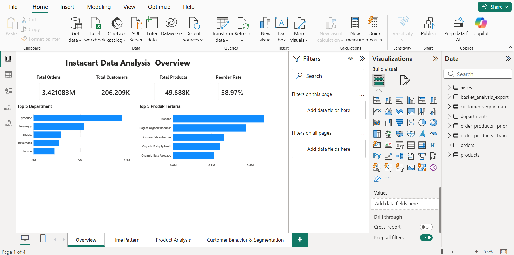
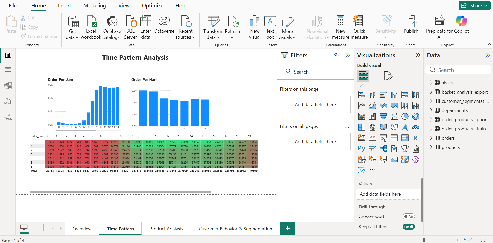
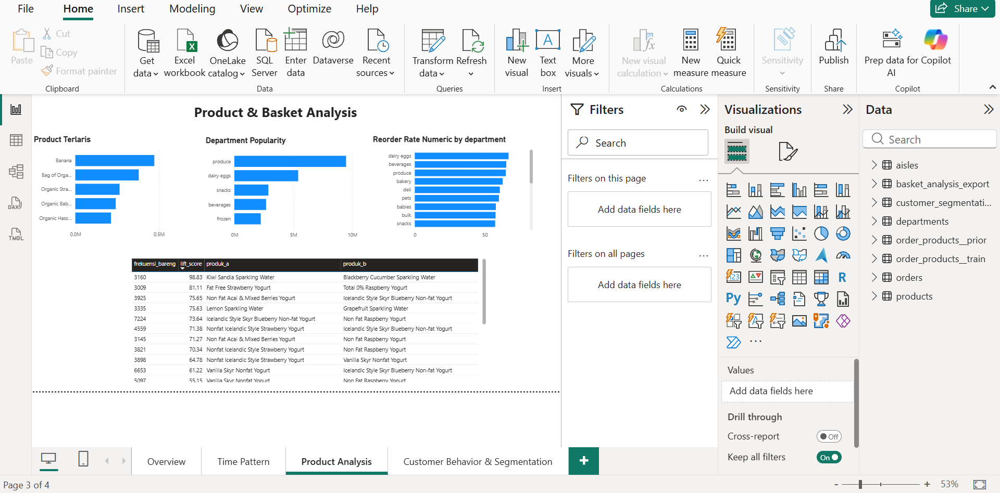
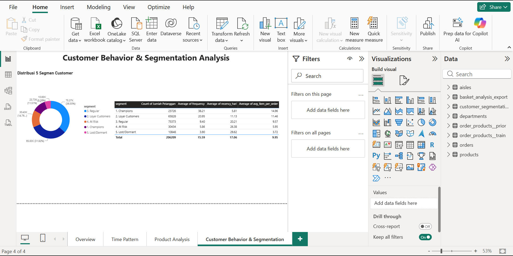

# 🛒 Instacart Data Analysis — End-to-End Data Analytics Project

Analisis end-to-end terhadap ~37.3 juta baris data transaksi real dari Instacart (aplikasi grocery delivery), mencakup data cleaning, analisis SQL mendalam, data pipeline, hingga dashboard interaktif di Power BI.

## 📌 Ringkasan Proyek

| | |
|---|---|
| **Dataset** | [Instacart Market Basket Analysis](https://www.kaggle.com/datasets/psparks/instacart-market-basket-analysis) (Kaggle) |
| **Skala Data** | ~37.3 juta baris, 6 tabel relasional |
| **Tools** | SQL (DuckDB), MySQL (XAMPP), Power BI |
| **Data Pipeline** | CSV → DuckDB (analisis) → MySQL (produksi) → Power BI (visualisasi) |

## 🎯 Tujuan Analisis

Menjawab pertanyaan bisnis seputar perilaku belanja pelanggan Instacart:
- Kapan pelanggan paling banyak berbelanja?
- Produk apa yang paling sering dibeli bersamaan?
- Kategori produk mana yang paling "sticky" (sering di-reorder)?
- Bagaimana karakteristik dan segmentasi pelanggan?

## 📊 Dashboard Preview

### Halaman 1 — Overview


### Halaman 2 — Time Pattern Analysis


### Halaman 3 — Product & Basket Analysis


### Halaman 4 — Customer Behavior & Segmentation


## 🔍 Temuan Utama

1. **"Perishability Drives Reorder"** — Produk yang cepat basi (susu, buah segar) memiliki reorder rate 80%+, sementara produk tahan lama (rempah-rempah) di bawah 10%.
2. **Office-Hours Shopping Pattern** — Puncak belanja terjadi jam 09:00-16:00, dengan hari Minggu-Senin sebagai periode restocking utama.
3. **Basis Pelanggan Sangat Loyal** — Reorder rate keseluruhan 58.97%, dengan 50.7% pelanggan berbelanja lagi dalam seminggu.
4. **Segmentasi RFE mengungkap ~20% pelanggan berisiko churn** (kategori At Risk & Lost/Dormant), membuka peluang kampanye re-engagement.
5. **Banana sebagai "Anchor Product"** — konsisten menjadi produk nomor satu di hampir semua dimensi analisis (basket analysis, reorder rate, starter product, item pertama di cart).

Detail lengkap 9 analisis tersedia di [`docs/portfolio_analysis_summary.md`](docs/portfolio_analysis_summary.md).

## 🗂️ Struktur Repository

```
instacart-data-analysis/
├── README.md
├── sql/                                    # Query SQL untuk 9 analisis
│   ├── 01_basket_analysis.sql
│   ├── 02_time_pattern_analysis.sql
│   ├── 03_customer_behavior.sql
│   ├── 04_department_analysis.sql
│   ├── 05_reorder_analysis.sql
│   ├── 06_order_size_analysis.sql
│   ├── 07_first_order_analysis.sql
│   ├── 08_customer_segmentation.sql
│   └── 09_add_to_cart_pattern.sql
├── dashboard/
│   └── screenshots/                        # Screenshot tiap halaman dashboard
├── docs/
│   ├── portfolio_analysis_summary.md       # Ringkasan 9 analisis & insight bisnis
│   └── project_documentation.md            # Dokumentasi proses end-to-end
└── .gitignore
```

## 🛠️ Metodologi & Skill yang Digunakan

**SQL (DuckDB):**
- JOIN multi-tabel, CTE (Common Table Expression)
- Window Functions: `ROW_NUMBER()`, `NTILE()`, `PARTITION BY`
- Subqueries, Aggregate Functions
- Kalkulasi statistik kustom (Lift Score untuk market basket analysis)
- Iterative query refinement (threshold tuning untuk menghindari bias statistik)

**Data Pipeline:**
- Import CSV ke DuckDB menggunakan `read_csv_auto()`
- Transfer data ke MySQL menggunakan DuckDB MySQL extension
- Verifikasi integritas data di setiap tahap perpindahan (row count matching)

**Power BI:**
- Data modeling (relasi antar 6 tabel)
- DAX measures (Reorder Rate, Total Pembelian, dll)
- Power Query (locale handling, tipe data, transformasi kolom)
- Berbagai jenis visual: KPI card, bar chart, heatmap matrix, donut chart, tabel data

## 📁 Dataset

Dataset asli dapat diunduh di: [Kaggle - Instacart Market Basket Analysis](https://www.kaggle.com/datasets/psparks/instacart-market-basket-analysis)

File CSV mentah tidak disertakan dalam repo ini karena ukurannya besar (~700MB). Silakan unduh langsung dari sumber di atas untuk mereproduksi analisis.

## 👤 Author

**Ahmad Farid**
- Email: ahmad.fariden@gmail.com
- LinkedIn: [linkedin.com/in/ahmadfariden](https://linkedin.com/in/ahmadfariden)
- GitHub: [github.com/ahmadfariden](https://github.com/ahmadfariden)

---

*Proyek ini dibuat sebagai bagian dari portofolio pembelajaran mandiri di bidang Data Analysis.*
